# Linux Commands Deep Dive

This document captures my hands-on learning experience with Linux commands in the DevOps program. Each command is shown with practical examples followed by a screenshot of its terminal output.

---

## 1. What is a Linux Command?

A Linux command is a typed instruction executed in the terminal.

**Syntax:**  
`command [option] [argument]`

Example:  
```bash
ls -l /home
```

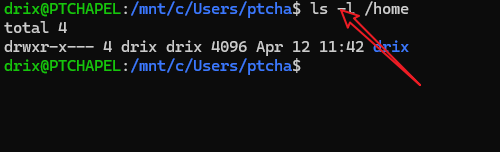

---

## 2. Manipulating Files and Directories

### 2.1 `sudo`

Grants superuser privileges.

Command to create a folder without `sudo`:
```bash
mkdir /root/example
```
_Result: Permission denied_  
  


Now with `sudo`:
```bash
sudo mkdir /root/example
```
_Result: Success_  
  


Finally, to verify:
```bash
sudo ls -l /root
```
  


---

### 2.2 `pwd`

Show current working directory.

```bash
pwd
```

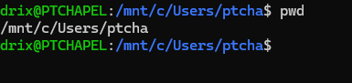

---

### 2.3 Linux Directory Structure

Change directory to root and list contents:
```bash
cd /
```

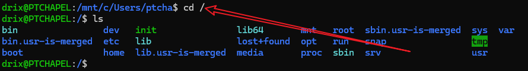

List the root directory:
```bash
ls
```
 


Change directory to `/usr`:
```bash
cd /usr
```
 
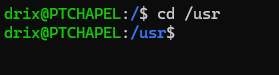

And list contents there:
```bash
ls
```
 
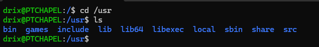

---

### 2.4 `cd`

Change to a specific directory, then show the working directory:
```bash
cd /usr/photos
```
 
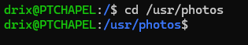

```bash
pwd
```


---

### 2.5 Side Hustle Task 1

1. Create a directory in `/usr`:
    ```bash
    sudo mkdir /usr/photos
    ```
    
    

2. Change into the new directory:
    ```bash
    cd /usr/photos
    ```
   
    

3. Create three subdirectories:
    ```bash
    sudo mkdir dir1 dir2 dir3
    ```
    
    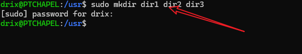

4. List the directories:
    ```bash
    ls -l
    ```
    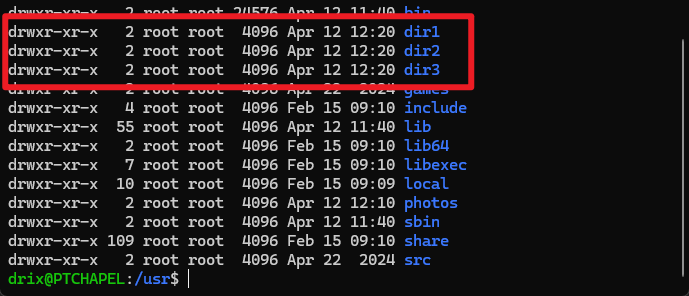

5. Change into one of them:
    ```bash
    cd dir1
    ```
    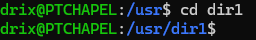

6. Confirm current directory:
    ```bash
    pwd
    ```
 
    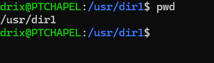

---

### 2.6 `ls`

List files with various options:

1. Basic listing:
    ```bash
    ls
    ```
    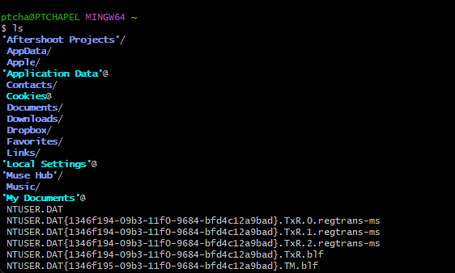

2. Long listing format:
    ```bash
    ls -l
    ```
    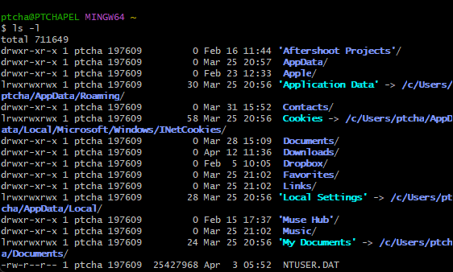

3. Including hidden files:
    ```bash
    ls -a
    ```
    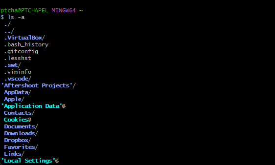

4. Recursive listing with human-readable sizes:
    ```bash
    ls -lhR /home
    ```
    _Screenshot:_  
    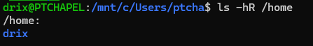

---

### 2.7 `cat`

Display file contents:

```bash
cat /etc/os-release
```
 
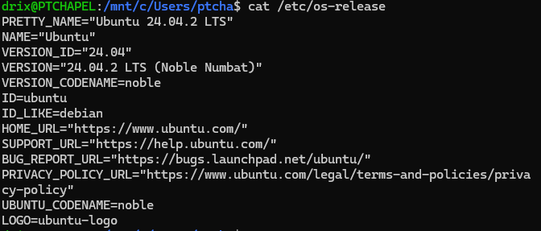

---

### 2.8 `cp`

Copy files and directories.

1. Copy a file:
    ```bash
    cp filename.txt /home/ubuntu/Documents
    ```
    
    

2. Copy multiple files:
    ```bash
    cp file1.txt file2.txt /home/ubuntu/Documents
    ```
    
    

3. Copy a file to a new name:
    ```bash
    cp source.txt destination.txt
    ```
      
    

4. Recursively copy a directory:
    ```bash
    cp -R source_dir/ destination_dir/
    ```
     
    

---

### 2.9 `mv`

Move or rename files.

1. Move a file:
    ```bash
    mv filename.txt /home/ubuntu/Documents
    ```
     
    

2. Rename a file:
    ```bash
    mv oldname.txt newname.txt
    ```
   
    

---

### 2.10 `rm`

Delete files or directories.

1. Remove a file:
    ```bash
    rm file.txt
    ```
      
    

2. Remove multiple files:
    ```bash
    rm file1.txt file2.txt
    ```
 
    

3. Remove a directory recursively:
    ```bash
    rm -rf folder_name/
    ```
    _Screenshot:_  
    

---

### 2.11 `touch`

Create an empty file.

```bash
touch /home/ubuntu/Documents/Web.html
```
  


---

### 2.12 `find`

Search for files by name.

```bash
find / -name "Web.html"
```
 

